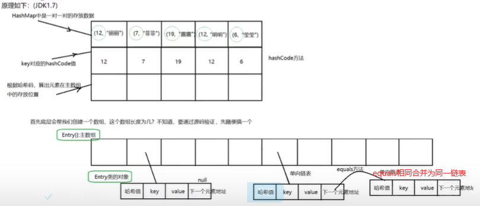

## 基础语法

### &和&&的区别

共同点：

- 都可以用作逻辑与的运算符，当运算符两边的表达式的结果都为 true 时，整个运算结果才为 true。

不同点：

- &&还具有短路的功能，即如果第一个表达式为 false，则不再计算第二个表达式。
- &还可以用作位运算符，即两位同时为“1”，结果才为“1”

### 隐式转换问题

**隐式转换**：`byte`,`short`,`char`-->`int`-->`long`-->`float`-->`double`

**注意**：从小到大可以隐式转换，数据类型将自动提升（整数和浮点数的存储规则不一样，记住一点long的范围是小于float的）

#### switch 语句能否作用在 byte 上，能否作用在 long 和string上?

- `switch（expr1）`中，expr1只能是一个整数表达式或者枚举常量，整数表达式可以是 `int`基本类型或 `Integer`包装类型
- switch语句能作用在 `byte short char`上，因为可以隐式转化为`int`类型
- switch语句能作用在 `long` 和 `String`上，因为不能隐式转换成 `int`类型

#### `short s1 = 1; s1 = s1 + 1;`正确吗? `short s1 = 1; s1 += 1;`正确吗?

- `short s1 = 1; s1 = s1 + 1;` 由于 `s1+1`运算时会自动提升表达式的类型，所以结果是`int`型，再赋值给`short`类型 `s1`时，编译错误。
- `short s1 = 1; s1 += 1;` 由于`+=`是 java 语言规定的运算符，java 编译器会对它进行特殊处理，因此可以正确编译。

### 抽象类和接口有什么区别

**相同点**：

1. 不能被实例化
2. 可以作为引用类型
3. 都需要对其中的抽象方法全部实现

**不同点**：

抽象类：（不能创建实例对象，允许有抽象方法）

  1. 可有构造方法
  2. 可有抽象方法和具体实现方法（非抽象方法）
  3. 成员可以是`private`,`protected`
  4. 可以有普通成员变量
  5. 可以包含静态方法
  6. 只能用`extend`单继承

接口（接口中的方法都是抽象方法，abstract关键字可省略）

  1. 不能有构造方法
  2. 只能有抽象方法（Java8后可以有默认实现方法`default`修饰：类优先原则）
  3. 成员变量类型默认是`public static final`
  4. 成员变量都是静态常量**
  5. 抽象方法默认类型且只能是`public abstract`
  6. Java8之后可包含静态方法
  7. 用`implements`实现多继承

**何时用？**

描述事物的本质/一种概念时用抽象类，描述一种操作时用接口（如：is/can）

### hashCode与 equals (重要)



- 如果两个对象的`hashCode` 值相等，那这两个对象不一定相等（哈希碰撞）。
- 如果两个对象的`hashCode`值相等并且`equals()`方法返回 `true`，我们才认为这两个对象相等。
- 如果两个对象的`hashCode` 值不相等，我们就可以直接认为这两个对象不相等。
- `equals` 方法判断两个对象是相等的，那这两个对象的 `hashCode` 值也要相等。

### == 和 equals() 的区别

`==`**对于基本类型和引用类型的作用效果是不同的(Java只有值传递)**:

- 对于基本数据类型来说，`==` 比较的是值。
- 对于引用数据类型来说，`==` 比较的是对象的内存地址。

`equals()`**方法存在两种使用情况**:

- 类没有覆盖`equals()`方法：通过`equals()`比较该类的两个对象时，等价于通过“==”比较这两个对象，使用的默认是 `Object`类`equals()`方法。
- 类覆盖了`equals()`方法 ：一般我们都覆盖`equals()`方法来比较两个对象中的属性是否相等；若它们的属性相等，则返回 true(即，认为这两个对象相等)。

### 构造方法有哪些特点？是否可被重写?

构造方法特点如下：

- 名字与类名相同。
- 没有返回值，但不能用 void 声明构造函数。
- 生成类的对象时自动执行，无需调用。

构造方法不能被 override（重写）即不能被继承，但是可以 overload（重载）原因：

- 重写是子类方法重写父类的方法，重写的方法名不变，而类的[构造方法](https://so.csdn.net/so/search?q=构造方法&spm=1001.2101.3001.7020)名必须与类名一致，假设父类的构造方法如果能够被子类重写则子类类名必须与父类类名一致才行，所以 **Java 的构造方法是不能被重写的。

### 重载和重写的区别

**重载**：发⽣在同⼀个类中，⽅法名必须相同，参数类型不同、个数不同、顺序不同，⽅法返回值和访问修饰符可以不同。

**重写**：重写发⽣在运⾏期，是⼦类对⽗类的允许访问的⽅法的实现过程进⾏重新编写。

1. 返回值类型、⽅法名、参数列表必须相同，抛出的异常范围⼩于等于⽗类，访问修饰符范围 ⼤于等于⽗类。
2. 如果⽗类⽅法访问修饰符为 private/final/static 则⼦类就不能重写该⽅法，但是被 static 修饰 的⽅法能够被再次声明。
3. 构造器 Constructor 不能被继承，因此构造⽅法⽆法被重写

综上：重写就是⼦类对⽗类⽅法的重新改造，外部样⼦不能改变，内部逻辑可以改变

------

|                |              |                                                              |
| -------------- | ------------ | ------------------------------------------------------------ |
| **区别点**     | **重载⽅法** | **重写⽅法**  |
| **发⽣范围**   |  同一个类     | 子类                                                         |
| **参数列表**   | 必须修改     | 一定不能修改（⽅法名相同、形参列表相同）                     |
| **返回类型**   | 可修改       | ⼦类⽅法返回值类型应⽐⽗类⽅法返回值类型更⼩或相等（如果⽅法的返回类型是void和基本数据类型，则返回值重写时不可修改。但是如果⽅法的返回值是引⽤类型，重写时是可以返回该引⽤类型的⼦类的。） |
| **异常**       | 可修改       | ⼦类⽅法声明抛出的异常类应⽐⽗类⽅法声明抛出的异常类更⼩或相等 |
| **访问修饰符** | 可修改       | ⼦类⽅法的访问权限应⽐⽗类⽅法的访问权限更⼤或相等。         |
| **发⽣阶段**   | 编译时       | 运行期                                                       |

### final,finally,finalize区别

- `final` ：用于声明属性，方法和类，分别表示属性不可变，方法不可覆盖，类不可继承。内部类要访问局部变量，局部变量必须定义成 final 类型。
- `finally`： 异常处理语句结构的一部分，表示总是执行。
- `finalize` ：`Object`类的一个方法，在GC垃圾收集器执行的时候会调用被回收对象的此方法，可以覆盖此方法提供垃圾收集时的其他资源回收，例如关闭文件等。JVM 不保证此方法总被调用。

### String,StringBuffer和StringBuilder 的区别是什么? String 为什么是不可变的?


 **可变性：**

- `String` 类中使用 `final` `private` 关键字修饰字符数组来保存字符串，所以不可变。

```java
public final class String implements java.io.Serializable, Comparable<String>, CharSequence {
    private final char value[];
}
```

- `StringBuilder`与 `StringBuffer`都继承自 `AbstractStringBuilder`类，使用字符数组保存字符串，但是没有使用`final` 和 - `private` 关键字修饰，最关键的是这个 `AbstractStringBuilder`类还提供了很多修改字符串的方法比如 `append` 方法，所以这两种对象都是可变的。

 **线程安全性**：

- `String` 中的对象是不可变的，可以理解为常量，线程安全。
- `StringBuffer`对方法加了同步锁或者对调用的方法加了同步锁，所以是线程安全的。—>效率低！
- `StringBuilder`并没有对方法进行加同步锁，所以是非线程安全的。—>效率高！

 **对于三者使用的总结**:

1. 操作少量的数据: 适用`String`
2. 单线程操作字符串缓冲区下操作大量数据: 适用 `StringBuilde`
3. 多线程操作字符串缓冲区下操作大量数据: 适用 `StringBuffe`

### Java 中的几种基本数据类型

- 6 种数字类型 ：`byte  short  int  long  float  double`
- 1 种字符类型：`char`
- 1 种布尔型：`boolean`
- 包装类分别为：`Byte`、`Short`、`Integer`、`Long`、`Float`、`Double`、`Character`、`Boolean`

| 基本类型 | 位数 | 字节 | 默认值 |
| -------- | ---- | ---- | ------ |
| `int`    | 32   | 4    | 0      |
| `short`  | 16   | 2    | 0      |
| `long`   | 64   | 8    | 0L     |
| `byte`   | 8    | 1    | 0      |

| `char`    | 16   | 2    | 'u0000' |
| --------- | ---- | ---- | ------- |
| `float`   | 32   | 4    | 0f      |
| `double`  | 64   | 8    | 0d      |
| `boolean` | 1    |      | false   |

### Integer 与 int的区别

Integer默认值为null，int的默认值为0；包装类型不赋值就是 `Null` ，而基本类型有默认值且不是 `Null`。

### 包装类型的常量池

`Byte  Short  Integer  Long` ：**[-128，127]**

`Character` ：**[0,127]**

`Boolean` ： `True` or `False`

`Float  Double`：**无**

### 自动装箱、拆箱

- `Integer i = 10` 等价于 `Integer i = Integer.valueOf(10)`
- `int n = i` 等价于 `int n = i.intValue()`;

```Java
Integer i = 10;  //装箱
int n = i;   //拆箱
```

### 作用域 public，private，protected，default的区别

| 作用域     | 当前类   | 同一包  | 子类   |  其他包 |
| --------  | --------| ------- | -------| -------|
| public    | √       |   √     | √      |   √    |
| protected | √       |   √     | √      |   ×    |
| default   | √       |   √     | ×      |   ×    |
| private   | √       |   ×     | ×      |   ×    |

### String s = new String("ab")创建了几个 String 对象?

1个或2个

- new String() 创建一个新的对象
- "ab"对应一个对象，这个对象放在字符串常量池中（初始时创建对象并放入）

### 深拷贝和浅拷贝区别？什么是引用拷贝？

- **浅拷贝**：浅拷贝会在堆上创建一个新的对象（区别于引用拷贝的一点），不过，如果原对象内部的属性是引用类型的话，浅拷贝会直接复制内部对象的引用地址，也就是说拷贝对象和原对象共用同一个内部对象。
- **深拷贝** ：深拷贝会完全复制整个对象，包括这个对象所包含的内部对象。


### 数组和List如何相互转化

- List转换成数组：`List.toArray()`/`List.toArray(T[] a)`

```java
List<String> list = new ArrayList<>();
Object[] array = list.toArray();
// 注意基本类型是不能作为泛型参数的
List<String> list = new ArrayList<>();
list.add("list-a");
list.add("list-b");
String[] array = list.toArray(new String[list.size()]);
```

- 数组转换成List：`Arrays.asList()`/`Collections.addAll(list,array[])`

```java
String[] array = {"a", "b"};
List<String> list = Arrays.asList(array);
// Collections
String[] array = {"a", "b"};
List<String> list = new ArrayList<>(array.length);
Collections.addAll(list, array);
```

### Get和Post的区别

- GET在浏览器回退（后退刷新）时是无害的，而POST会再次提交请求。
- GET产生的URL地址可收藏为书签，而POST不可以。
- GET请求会被浏览器主动缓存，而POST不会，除非手动设置。
- GET请求只能进行url编码，而POST支持多种编码方式。
- GET请求参数会被完整保留在浏览器历史记录里，而POST中的参数不会被保留。
- GET请求在URL中传送的参数是有长度限制的，而POST没有限制。
- 对参数的数据类型，GET只接受ASCII字符，而POST没有限制。
- GET比POST更不安全，因为参数直接暴露在URL上，所以不能用来传递敏感信息。
- GET参数通过URL传递，POST放在请求体中。
- GET产生一个TCP数据包，POST产生两个TCP数据包。

### 转发(Forward)和重定向(Redirect)的区别

**本质：转发是服务器行为，重定向是客户端行为。**

- 从地址栏显示来说：

  1. forward是服务器内部的重定向，服务器直接访问目标地址的 url网址，把里面的东西读取出来，但是客户端并不知道，因此用forward的话，客户端浏览器的网址是不会发生变化的。
  2. redirect是服务器根据逻辑，发送一个状态码，告诉浏览器重新去请求那个地址，所以地址栏显示的是新的地址。

- 从数据共享来说：

  1. 由于在整个定向的过程中用的同一个request，因此forward会将request的信息带到被重定向的jsp或者servlet中使用。即可以共享数据。
  2. redirect不能共享数据。

- 从运用的地方来说：

  1. forward一般用于用户登录的时候，根据角色转发到相应的模块。
  2. redirect一般用于用户注销登录时返回主页面或者跳转到其他网站。

- 从效率来说：

  1. forward效率高。
  2. redirect效率低。

- 从请求的次数来说：

  1. forward只有一次请求。
  2. redirect有两次请求。

举例说明：

- 假设你去办理某个执照，重定向：你先去了A局，A局的人说：“这个事情不归我们管，去B局”，然后，你就从A退了出来，白己乘车去了B局。转发：你先去了A局，A局看了以后，知道这个事情其实应该B局来管，但是他没有把你退回来，而是让你坐一会儿，自己到后面办公室联系了B的人，让他们办好后，送了过来。

### Cookie和Session的区别

**Cookie 一般用来保存用户信息** 比如①我们在 Cookie 中保存已经登录过得用户信息，下次访问网站的时候页面可以自动帮你登录的一些基本信息给填了；②一般的网站都会有保持登录也就是说下次你再访问网站的时候就不需要重新登录了，这是因为用户登录的时候我们可以存放了一个 Token 在 Cookie 中，下次登录的时候只需要根据 Token 值来查找用户即可(为了安全考虑，重新登录一般要将 Token 重写)；③登录一次网站后访问网站其他页面不需要重新登录。

**Session 的主要作用就是通过服务端记录用户的状态**。 典型的场景是购物车，当你要添加商品到购物车的时候，系统不知道是哪个用户操作的，因为 HTTP 协议是无状态的。服务端给特定的用户创建特定的 Session 之后就可以标识这个用户并且跟踪这个用户了。

- cookie是存放在浏览器上的，session是存放在服务器上的。
- cookie数据不安全，如果考虑到安全应使用session。
- session会增加服务端的内存压力,考虑到减轻服务器性能方面，应当使用cookie。
- cookie只能存放一对字符串k-v

## 泛型

### 什么是泛型？伪泛型？类型擦除？

**泛型：**

- JDK1.5引入
- 本质是参数化类型，也就是说所操作的数据类型被指定为一个参数
- 作用：提高代码的复用性

**伪泛型：**

- Java 的泛型其实是伪泛型，因为 Java 在编译期间，所有的泛型信息都会被擦掉，这也就是通常所说类型擦除

**类型擦除：**

- 将所有的泛型信息替换为具体的类型，就像完全没有泛型一样

### 基本类型能不能作为泛型？

- 不能
- 因为类型擦除后，变为原始类型`Object`，但是`Object`类型不能存储`Int`型，只能引用`Integer`的值

### 如何理解泛型的编译器检查

- Java编译器是通过先检查代码中泛型类型，然后在进行类型擦除，再进行编译

## 反射

### 什么是反射？反射的核心类有哪些？应用场景？

**反射：**

- 在运行的时候，可以通过反射获取任意一个类的所有属性和方法，还可以调用这些方法和属性
- **作用**：使代码更加灵活，但性能会有影响

**核心类：**

- `Class`类：**`Class.forName()`、`object.getClass()`、`xxxClassLoader.loadClass()`**
- `Field`类
- `Method`类
- `Constructor`类

**应用场景**：

- 框架中的JDK动态代理
- 注解

### JDK动态代理和CGLIB动态代理是什么？

 动态代理：

- JVM 角度来说，动态代理是在运行时动态生成类字节码，并加载到 JVM 中的

 JDK动态代理：只能代理实现了接口的类（效率更高）

- 核心类：`InvocationHandler` 接口和`Proxy`类
- 定义一个**接口**及其实现类；
- 实现**`InvocationHandler`**接口并重写`invoke(Object proxy, Method method, Object[] args)`方法
- 通过`Proxy.newProxyInstance(ClassLoader loader, Class<?>[] interfaces, InvocationHandler h)`方法创建代理对象；

 CGLIB动态代理：**可以代理未实现任何接口的类**且需要添加依赖

- 核心类：`MethodInterceptor`接口和`Enhancer`类
- 定义一个类；
- 自定义 `MethodInterceptor`接口并重写 `intercept` 方法，`intercept` 用于拦截增强被代理类的方法，和 JDK 动态代理中的 `invoke` 方法类似；
- 通过 `Enhancer`类的 `create()`创建代理类；

## 异常

### 异常有哪些？


### try-catch-finally中finally注意事项

- **`try`块**： 用于捕获异常。其后可接零个或多个 `catch` 块，如果没有 `catch` 块，则必须跟一个 `finally` 块。
- **`catch`块**: 用于处理 try 捕获到的异常。
- **`finally`块**： 无论是否捕获或处理异常，`finally` 块里的语句都会被执行。当在 `try` 块或 `catch` 块中遇到 `return` 语句时，`finally` 语句块将在方法返回之前被执行。
- **注意**：不要在 finally 语句块中使用 return!！！当 try 语句和 finally 语句中都有 return 语句时，try 语句块中的 return 语句不会被执行。

```java
public static void main(String[] args) {
    System.out.println(f(2));;
}

public static int f(int value) {
    try {
        return value * value;
    } finally {
        if (value == 2) {
            return 0;
        }
    }
}

//结果为：0
```

## IO流

### Java 中 IO 流分为几种?

- （流向）可以分为输入流（`InputXXX/Reader`）和输出流（`OutXXX/Writer`）；
- （操作单元）可以划分为字节流（`InputStream/OutStream`）和字符流（`Reader/Writer`）；
- （流的角色）划分为节点流和处理流（带缓冲的`Buffered/Data/Object/PrintXXX`）。

### 什么是序列化和反序列化（I/O）？

- **序列化**： 将**数据结构**或**对象**转换成**二进制**字节流存储到**文件系统、数据库、内存中**。
- **反序列化**：将在序列化过程中所生成的二进制字节流转换成数据结构或者对象的过程

 扩展：

`transient` 关键字：**阻止****对象****序列化**。

- `transient` **只能修饰变量**，不能修饰类和方法。
- `transient` 修饰的变量，在反序列化后变量值将会被置成类型的**默认值**。例如，如果是修饰 `int`类型，那么反序列后结果就是 `0`。
- `static` 变量因为不属于任何对象(Object)，所以无论有没有 `transient` 关键字修饰，均不会被序列化

### NIO、BIO、AIO的区别？

- **BIO （Blocking I/O）**：同步阻塞I/O 模式。
- **NIO （No-Blocking I/O）**：同步非阻塞 I/O 模式。
- **AIO （Asynchronous I/O）**：异步非阻塞 I/O 模型。

 形象比喻：

**BIO**：先来到厨房，开始烧水，并坐在水壶面前一直等着水烧开。(**阻塞**)

**NIO**：先来到厨房，开始烧水，但是我们不一直坐在水壶前面等，而是回到客厅  看电视，然后每隔几分钟到厨房看一下水有没有烧开。(**选择器监听**)

**AIO**：先来到厨房，开始烧水，不一直坐在水壶前面等，也不隔一段时间去看一下，而是在客厅看电视，水壶上面有个开关，水烧开之后他会通知我。(**回调**)


