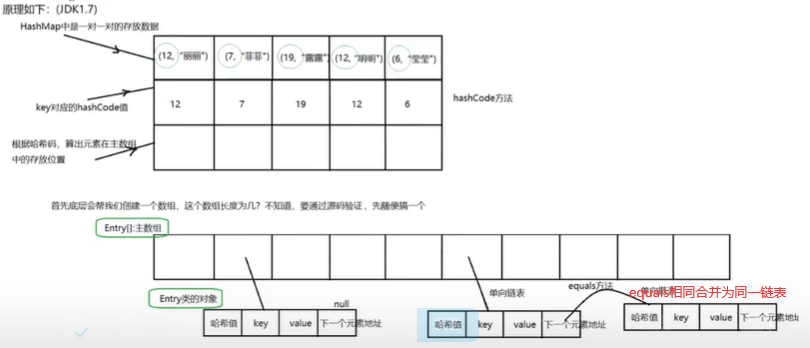

#### List（有序）

- `Arraylist`： `Object[]` 数组，线程不安全，效率高；数组不够用时在原来的基础上扩展0.5倍；
- `Vector(旧)`： `Object[]` 数组，线程安全，效率低。数组不够用时在原来的基础上扩展1倍；
- `LinkedList`： 双向链表，线程不安全，支持存储 `NULL` 数据

#### Set（都是唯一、线程不安全）

- `HashSet`(无序）: 基于 `HashMap`实现的哈希表，底层采用 `HashMap`来保存元素
- `LinkedHashSet`(先进先出): `LinkedHashSet`是 `HashSet`的子类，并且其内部是通过 `LinkedHashMap`来实现的链表+ 哈希表。类似于 `LinkedHashMap`其内部是基于 `HashMap`实现一样
- `TreeSet`(有序): 红黑树(自平衡的排序二叉树)

#### Queue（单端队列）

- `PriorityQueue`: `Object[]` 数组来实现二叉堆
- `ArrayQueue`： `Object[]`可变长数组 + 双指针，不支持`Null`存储，可扩容
- `DeQueue(接口)`：双端队列 

#### Map（键值对获取）

- `HashMap`： JDK1.8 之前由数组+链表组成的，数组是 `HashMap`的主体，链表则是主要为了解决哈希冲突而存在的（拉链法解决冲突）。JDK1.8 以后在解决哈希冲突时有了较大的变化，当链表长度大于阈值时，将链表转化为红黑树，以减少搜索时间（不安全、无序、允许空Key和空Value！）
- `LinkedHashMap`：继承自 `HashMap`，由数组和链表或红黑树组成。另外，在此结构的基础上，增加了一条双向链表，使得上面的结构可以保持键值对的插入顺序。同时通过对链表进行相应的操作，实现了访问顺序相关逻辑。
- `Hashtable(旧)`： 数组+链表组成的，线程安全(synchronized同一把锁），效率低（不允许Key为空！）
- `TreeMap`(有序)： 红黑树（自平衡的排序二叉树），实现了`NavigableMap(搜索功能)和SortedMap(键排序功能)`
- `ConcurrentHashMap`：线程安全（1.7分段锁、1.8 synchronized + CAS乐观锁）

## List, Set, Queue, Map 四者的区别？

- `List`(顺序): 存储的元素是有序的、可重复的。
- `Set`(去重): 存储的元素是无序的、不可重复的。
- `Queue`(队列先进先出): 按特定的排队规则来确定先后顺序，存储的元素是有序的、可重复的。
- `Map`(键值对): 使用键值对（key-value）存储，key是无序的、不可重复的，value 是无序的、可重复的，每个键最多映射到一个值。

## HashMap的原理？

#### JDK1.8之前:(性能会稍差) 

数组 + 链表 (链表散列），通过 key 的`hashCode`经过扰动函数(减少碰撞)处理过后得到 hash值再经过哈希算法获得数组索引位置；若存在元素，通过`equal`判定hash值和key值是否相同，相同则覆盖，不同则拉链法解决冲突（碰撞）。

#### JDK1.8之后：

`Entry`数组 + 链表 +红黑树(更好解决冲突)，hash值和key值（通过`equal`比较后不同时）不同则：当链表长度大于阈值（默认为 8）（将链表转换成红黑树前会判断，如果当前数组的总长度小于 64，那么会选择先进行数组扩容，而不是转换为红黑树，即链表长度>8，总容量>64）时，将链表转化为红黑树（动态平衡二叉树），以减少搜索时间。

  

## CurrentHashMap的底层原理？

#### JDK1.7

首先将数据分为一段一段的存储，然后给每一段数据配一把锁，当一个线程占用锁访问其中一个段数据时，其他段的数据也能被其他线程访问。（ConcurrentLevel=16）

`ConcurrentHashMap`是由 `Segment` 数组结构和 `HashEntry`数组结构组成。

Segment 实现了 `ReentrantLock`,所以 `Segment` 是一种可重入锁，扮演锁的角色。`HashEntry` 用于存储键值对数据。

一个 `ConcurrentHashMap`里包含一个 `Segment` 数组。`Segment` 的结构和 `HashMap`类似，是一种数组和链表结构，一个 `Segment` 包含一个 `HashEntry`数组，每个 `HashEntry`是一个链表结构的元素，每个 `Segment` 守护着一个 `HashEntry`数组里的元素，当对 `HashEntry`数组的数据进行修改时，必须首先获得对应的 `Segment` 的锁。

#### JDK1.8 (CAS无锁算法)

`ConcurrentHashMap`取消了 `Segment` 分段锁，采用 CAS 和 `synchronized` 来保证并发安全。数据结构跟 HashMap1.8 的结构类似，数组+链表/红黑二叉树。Java 8 在链表长度超过一定阈值（8）时将链表转换为红黑树。

`synchronized` 只锁定当前链表或红黑二叉树的首节点，这样只要 hash 不冲突，就不会产生并发，效率又提升 N 倍。

## Collection实现比较的接口Comparable 和 Comparator的区别？

- `comparable` 接口实际上是出自`java.lang`包它有一个`compareTo(Object obj)`方法用来排序
- `comparator`接口实际上是出自`java.util`包它有一个`compare(Object obj1, Object obj2)`方法用来排序

## ConcurrentHashMap和Hashtable的区别

#### Hashtable线程安全:使用 `synchronized` 来保证线程安全

#### ConcurrentHashMap线程安全？

JDK1.7： （分段锁）`Segment`数组(实现可重入锁ReentrantLocks) + `HashEntry`数组 + 链表

JDK1.8：（`synchronized` 和 `CAS`）`Node` 数组+链表+红黑树

## Collection 和 Collections 的区别?

  Collection：集合类上级接口，继承它的接口主要有List、Set、Queue

  Collections：工具类，提供对集合的查找，替换，排序以及线程安全化

## ArrayList扩容机制（简）

- `add()`
- `ensureCapacityInternal()`
- `ensureExplicitCapacity()`
- `grow()`
- `hugeCapacity()`
